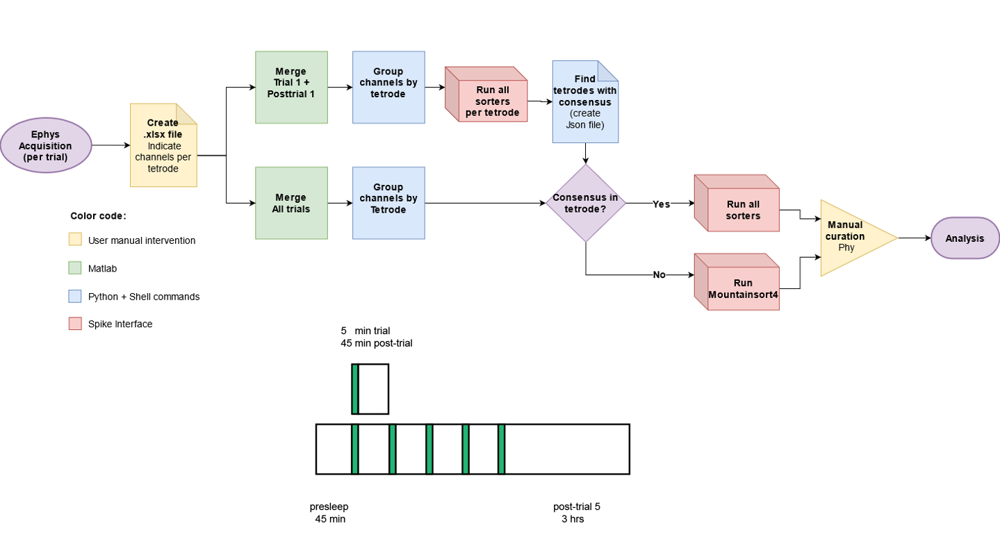

# SpikeSorting: Object Space Task Pipeline

Automatic and manual spike sorting for tetrode recordings based on SpikeInterface.

<p align="center">

</p>
<p align="center">

</p>

## Dependencies

Same as [SpikeInterface](https://github.com/SpikeInterface/spiketutorials/blob/master/old_api/NWB_Developer_Breakout_Session_Sep2020/environment.yml)

> ⚠️ **Important**: This pipeline uses the SpikeInterface version from 2020. Compatibility has not been tested with newer versions.

Please install each sorter as described here:  
👉 [SpikeInterface Sorter Installation Guide](https://spikeinterface.readthedocs.io/en/latest/install_sorters.html)

If the method above causes issues, try these [detailed installation instructions (PDF)](https://github.com/Aleman-Z/spikesorting/blob/main/spikesorting-setup.pdf).

When using **Matlab-based sorters**, save them in:

```
~/Documents/SpikeSorting/
```

To be used on **Linux** 🐧. Add this folder to your path temporarily:

```bash
export PYTHONPATH=$PYTHONPATH:/path/to/this/folder
```

To make it permanent, paste it into your bashrc:

```bash
gedit ~/.bashrc
```

---

## Spike Sorting Pipeline

### 1. Activate your conda environment

```bash
conda activate <Name of environment>
```

---

### 2. Check for corrupt or uneven length files

```bash
python -m check_length ‘/full/path/to/folder_with_Study_day_subfolders’
```

> ⚠️ Ensure trial folders don’t have duplicate channel files like `100_CH1.continuous` and `100_CH1_2.continuous`.

---

### 3. Select trials or merge trials (Trial1 + PostTrial1 or full-day)

Use `merge_channels_revised_T1_PT1.m` or `merge_channels_revised.m` in MATLAB.  
Ensure correct **sampling rate (fs)**:  
- Rats 1–9 used **20kHz**, not 30kHz.

Check `folders` variable in the MATLAB script and make sure it lists the correct trial folders in the right order.

📌 Refer to the file:  
`RAT_OS_EPHYS_Channel_Normalization_Across_Animals.xlsx` (Dropbox)

> 💡 Run merging twice:  
1. Trial1 + PostTrial1  
2. Presleep + T1 + PT1 + … + T5 + PT5 (+ Novelty trial if applicable)

📋 Refer to this [Google Planning Sheet](https://docs.google.com/spreadsheets/d/1FvTOxkV9HDviEM8qUjApdJ_2NViZCOhmVhzIALzLDKA/edit#gid=949291845)

Generate `hpc.xlsx` and `cortex.xlsx` with tetrode IDs and channel info.  
Skip tetrodes with only 1 channel or reference tetrodes.

---

### 4. Fix file names if needed

```bash
python -m fix_channel_name ‘/path/to/continuous_files’
```

Copy the following files from the same study day (any trial or post-trial folder):

- `all_channels.events`
- `Continuous_Data.openephys`
- `messages.events`
- `settings.xml`
- [`tetrode.prb`](https://github.com/Aleman-Z/spikesorting/blob/main/tetrode.prb) (same for all rats)
- `hpc.xlsx` and `cortex.xlsx` (omit `hpc.xlsx` if not sorting HPC)

> 💻 Work locally! Copy the merged folder to your computer's **data hard drive**.

---

### 5. Rearrange data by tetrode

```bash
python -m rearrange_folders ‘/path/to/merged_data’
```

📌 If only sorting **cortical** tetrodes, ensure `rearrange_folders.py` uses:

```python
folders = ['cortex']
```

Instead of:

```python
folders = ['hpc', 'cortex']
```

---

### 6. Run automatic spike sorting

```bash
python -m run_tetrodes ‘/path/to/brain_region_folder_with_tetrodes’
```

> 💡 Prefer using **Spyder** (prevents crashes):

```bash
conda activate spiketutorial
spyder
```

In Spyder:
- Load `run_tetrodes.py`
- Set the correct path in the `folder` variable
- Press `Ctrl+A` then `F9` to run the script

---

### 7. Create JSON for consensus

```bash
python -m create_json ‘/path/to/brain_region_folder’
```

Copy JSON files to the respective brain area folders of the **full-day merged** folder.

To run manual curation:

```bash
python -m run_tetrodes_manual ‘/path/to/brain_region_folder_with_tetrodes’
```

---

### 8. Manual curation with Phy

During manual curation:
- `Alt+N` = Noise  
- `Alt+M` = MUA  
- `Alt+G` = Pyramidal unit  
- Leave unlabeled = Interneuron

> ⚠️ Always **save first**, then close. If you close first and then save, your curation won't be saved.

---

### 9. Activation matrix & consensus post-curation

Both scripts (`run_tetrodes.py` or `run_tetrodes_manual.py`) create a `phy` folder with:

- `spike_times.npy`
- `spike_clusters.npy`

You can generate activation matrices (25 ms bins) as `actmat_auto_tetrode#`.

To concatenate and detect assemblies:

```bash
python -m phy2assembly
```

To view previous detections:

```bash
os.system('phy template-gui phy_AGR/params.py')
```

Post-curation consensus:

```bash
python -m consensus_post_curation ‘/path/to/tetrode_folder’
```

---

### 10. Quality Metrics

```bash
python -m quality_metrics
```

Requires:

```bash
conda env create -f environment_qm.yml
conda activate spiketutorial_qm
```

---

## Running in Spyder

1. Open `run_tetrodes.py`  
2. Press `Ctrl+A`, then `F9`

---

## Running in Linux Terminal (Adrian's PC only)

```bash
./loop
```

This calls `run_tetrodes_brain_areas.py` in a loop.  
Download [loop.sh](https://github.com/Aleman-Z/spikesorting/blob/main/loop%20(copy)) → rename to `loop`.

Add `loop` to your PATH in `~/.bashrc`.

Modify `sorter.py`: add `exit()` to the end of `ms4()` and `auto()` functions.

---

## Reading corrupted Open Ephys files

Navigate to:

```
/home/Username/anaconda3/envs/spiketutorial/lib/python3.6/site-packages/pyopenephys
```

Modify:

- [`openephys_tools.py`](https://github.com/Aleman-Z/spikesorting/blob/main/openephys_tools.py#L49-L85)
- [`core.py`](https://github.com/Aleman-Z/spikesorting/blob/main/core.py#L723-L727)

---

## Newest scripts (yet to be described)

- `run_tetrodes_brain_areas.py`
- `run_tetrodes_json.py`
- `run_tetrodes_loop.py`
- `truncate2.py`
