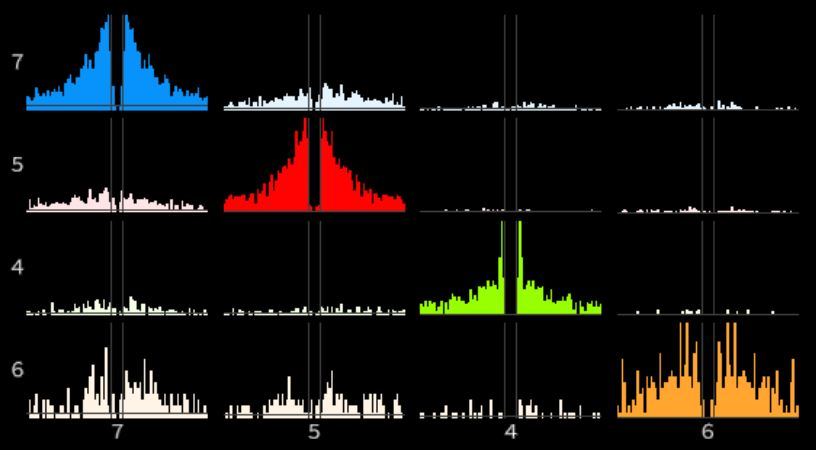

# spikesorting
Automatic and manual spike sorting for tetrodes recordings based on SpikeInterface.
<p align="center">

</p>

Dependencies: Same as [Spikeinterface](https://github.com/SpikeInterface/spiketutorials/tree/master/NWB_Developer_Breakout_Session_Sep2020)

Please install each sorter as mentioned on this page:

https://spikeinterface.readthedocs.io/en/latest/sortersinfo.html

For Matlab-based sorters please save them in the following folder : ~/Documents/SpikeSorting/

To be used on Linux :penguin: Add this folder to your path by typing in terminal:
```
export PYTHONPATH=$PYTHONPATH:/path/to/this/folder
```
or pasting it in `gedit ~/.bashrc` to add it permanently.

-----------------------
## Spike sorting pipeline.
1.	Make sure your files are not corrupted or your channels have different lengths.  For that run `check_length.py`.
```
python -m check_length ‘complete_path_of_folder_with_Study_day_subfolders’
```

2.	Select trial/post-trial. This could also be a merged version of them. To concatenate .continuous files from different trials run the `merge_channels.m` script in Matlab. Generate the hpc.xlsx and cortex.xlsx files indicating the tetrodes ID and their channels. Omit tetrodes which only have one valid channel or that are reference tetrodes.
3.	If necessary fix file names by removing extra ‘_0’.  Run `fix_channel_name.py`.
```
python -m fix_channel_name ‘complete_path_of_folder_with_.continuous_files’
```
copy these files into the merged folder:

-all_channels.events

-Continuous_Data.openephys

-messages.events

-settings.xml

-tetrode.prb

4.	Group channels by tetrode and save them in a new folder for that tetrode by running  `rearrange_folders.py`. 
```
python -m rearrange_folders ‘complete_path_of_folder_with_ephys_data’
```
5.	Activate the environment where SpikeInterface was installed. 
```
conda activate <Name of environment>
```
6. Run the automatic spike sorter by going to terminal and typing:
```
python -m run_tetrodes  ‘complete_path_of_brain_region_folder_with_tetrodes’
```
If you are running this first on the concatenated 'Trial1+PostTrial1 signal, then you need to generate the JSON file
which will indicate the sorter if there was consensus or not and if it should run all sorters on the whole day recording.
To do this you can use `create_json.py`:
```
python -m create_json  ‘complete_path_of_brain_region_folder_with_tetrodes’
```
Once you have the JSON files from both brain areas you may copy them into their respective brain area in the whole day 'merged' folder.

  For manual scoring type:
```
python -m run_tetrodes_manual  ‘complete_path_of_brain_region_folder_with_tetrodes’
```

7.	If you are running `run_tetrodes_manual.py` the phy interface will pop up. Asking you to look at the detections from the used sorters and perform a manual curation. To label a detection as noise select it and press `Alt+N`. To label as MUA press `Alt+M`. To label as pyramidal unit press `Alt+G`. To label as interneuron simply leave it without a label (unsorted).  :warning: Very important: Once you are done make sure to __first save and then close the interface__. If you first close the interface a message will ask you to save but even if you do it, it will not save your curations! :warning:
8.	For either `run_tetrodes.py` or `run_tetrodes_manual.py` a phy folder will be created, were one can find the spike_times.npy and spike_clusters.npy files. By binarizing the spike times of each spike (bin of 25ms) one can generate the activation matrix needed for the cell assembly analysis. This matrix is saved as ‘actmat_auto_tetrode#’.
9.	The `phy2assembly.py` script will concatenate all activation matrices across tetrodes and then run the cell assembly detection.

To load pre-computed sorter results and export to phy with the raw signal you can use this script and adapt accordingly:
`view_sorter_detections.py`

To view previously computed consensus-based units in phy simply type this line in the tetrode folder:
```
os.system('phy template-gui phy_AGR/params.py')
```
To view a new consensus after having done a manual curation use:
```
python -m consensus_post_curation  ‘complete_path_of_tetrode_folder’
```
## Running in Spyder.
For spyder open run_tetrodes.py but DONT RUN IT.
Instead press:
```
Ctrl+A   # This will select the script.
F9  # This will run the script.
```


## Running in Linux terminal.
Currently this approach only works in Adrian's PC but it is the fastest way to spike sort.
All you must do is type:
```
./loop
```
This will call run_tetrodes.py in an infinite loop. So make sure to stop it eventually!


